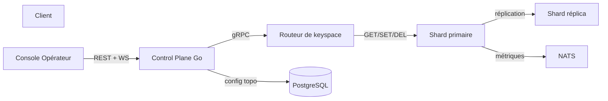

# Cache Orbit

> Plateforme de cache distribué avec invalidation explicite, gouvernance de topologie et mitigation des hot-keys — pensée pour les équipes d'infrastructure critique.

## Pourquoi ce projet ?

Le caching bien géré réduit la latence utilisateur, la charge backend et les coûts d'infrastructure. Le caching mal géré est l'une des causes majeures d'incidents de production : stale data, stampede backend, hot-keys non détectées, topologie opaque et invalidation inconsistante. **Cache Orbit** résout ce problème par un contrôle-plane explicite et un moteur haute performance.

## Capacités

- **Topologie de cache** : clusters, shards, réplicas modélisés en tant que ressource gouvernable.
- **Partitionnement de keyspace** : hash consistant 1024 partitions, repliement automatique.
- **Invalidation explicite** : garanties de cohérence (éventuelle → forte), par clé, par pattern, par tag.
- **Détection des hot-keys** : fenêtre glissante, analyse P50/P99, replication automatique, circuit breaker.
- **Observabilité production** : hit ratio, latences P50/P99, staleness, contention, QPS par partition.

## Démarrage en 30 secondes

### Option 1 — Vérification locale rapide (sans Docker)

```powershell
# Terminal 1 — Control Plane (Go)
cd src\control-plane
go mod tidy
go run main.go

# Terminal 2 — Console Opérateur (Node.js)
cd src\operator-ui
npm install
npm run dev
# → http://localhost:3000
```

### Option 2 — Stack complète Docker Compose

```powershell
make dev
```

Services exposés :
- **UI Opérateur** : http://localhost:3000
- **Control Plane** : http://localhost:8080
- **Cache Engine** : localhost:6379
- **Prometheus** : http://localhost:9090
- **Grafana** : http://localhost:3001

## Architecture en 30 secondes



## Stack technique

| Composant | Technologie |
|-----------|-------------|
| Moteur de cache | Rust (axum, moka, tokio, prometheus) |
| Control plane | Go (Gin, NATS, zap) |
| Console opérateur | Next.js 14, TypeScript, Tailwind |
| Métadonnées | PostgreSQL |
| File d'invalidation | NATS |
| Observabilité | Prometheus + Grafana |
| Containers | Docker Compose |
