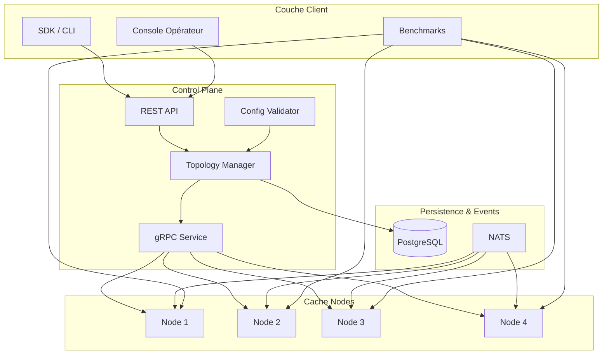

# Architecture de Cache Orbit

## Objectifs d'architecture

Conception d'un cache distribué capable de maintenir un contrat SLI strict (hit ratio ≥ 95 %, latence P99 ≤ 5 ms) tout en supportant un rebalancement de topologie sans interruption de service.

## Sous-systèmes



### 1. Routeur de keyspace (partitioning)

Le keyspace est découpé en **1024 partitions virtuelles**. Une table de routage (mise à jour atomiquement) associe chaque partition à un nœud primaire + 2 réplicas. La fonction de hachage utilise **blake3** pour un partitionnement rapide et uniforme.

```
partition_id = blake3(key) mod 1024
primary     = partition_map[partition_id]
replicas     = [replica_for(partition_id, offset=0), replica_for(partition_id, offset=1)]
```

### 2. Nœud de cache (cache-engine)

Chaque nœud expose :

- **Surcouche L1 (local) :** 256 MB par défaut, TTL court (30s), éviction LRU.
- **Surcouche primaire :** 1M entrées par défaut, persistant les données structurées (`CacheEntry`).
- **Détecteur de hot-key :** fenêtre coulissante Nagle-like avec agrégation au 99e percentile.
- **File d'invalidation :** canal `mpsc` tokio de 64k éléments, eventuellement saturé et journalisé.

### 3. Control plane (Go)

Responsable de :

- stocker la topologie dans PostgreSQL avec versionnement optimiste,
- distribuer les mises à jour par gRPC aux nœuds,
- exposer l'API REST et le WebSocket temps réel à l'opérateur console.

### 4. Invalidations distribuées

Deux canaux :

- **Invalidation locale :** chaque suppression de clé invalide directement la partition locale.
- **Invalidation broadcast :** événement publié sur NATS, consommé par tous les nœuds (compensation cross-shard).

Garantie de cohérence :

| Niveau | Sémantique |
|--------|------------|
| `Weak` | Meilleur effort, pas de vérification. |
| `BoundedStaleness` | Max X ms de dérive acceptable. |
| `Strong` | Aquorum de écriture + version vectorielle. |

### 5. Mitigation des hot-keys

Détection : compteur sliding window 60s par clé, notifie quand QPS > seuil configuré et latence P99 > 15ms.

Réponse automatique :

- création d'une **réplica locale chaud** (co-locé dans le même shard),
- limitation de lecture côté application via `Cell`, `Bucket` RateLimiter,
- alerte temps réel dans la console opérateur (heatmap rouge).

### 6. Observabilité

- `EngineStats` exposé en Prometheus via `/metrics`,
- logs structurés JSON avec `tracing-subscriber`,
- trace distribuée via `metrics` crate (TODO: intégration OTEL).

### Décisions de design

| Décision | Raison |
|----------|--------|
| Rust pour le moteur | performance prédictible, absence de GC, typage strict |
| Hash blake3 | rapide, cryptographique, bon entropie |
| Moka comme backend | cache threadsafe, métriques intégrées, absent de jemalloc (performance avérée) |
| Go pour le control plane | typage statique faible, écosystème cloud-native mature |
| PostgreSQL pour la config | ACID, capacité à requêter la topologie (rebalancing, audit) |
| NATS pour l' event stream | latence < 1ms, at-least-once, scaling simple |
